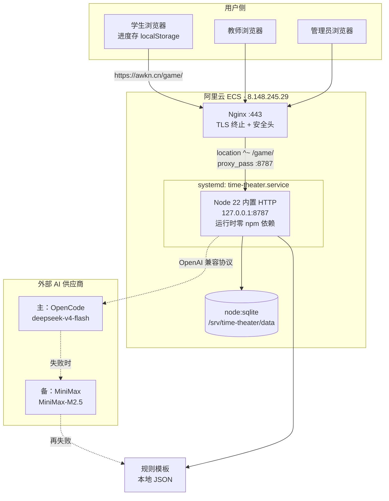
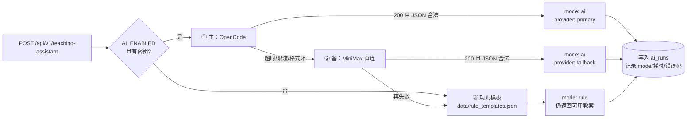
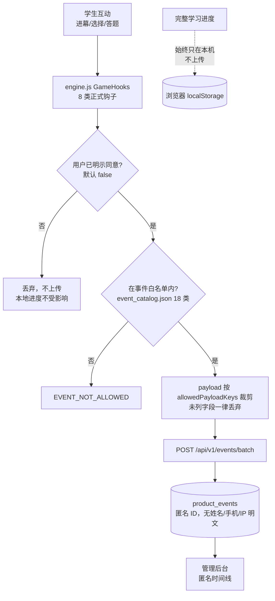

# 技术架构图

> 与 2026-08-05 生产实测状态一致。Mermaid 图可直接粘进 PPT / 语雀 / GitHub。

---

## 1. 部署架构



**关键点**

- Node 只监听 `127.0.0.1:8787`，**不暴露公网**，全部流量经 Nginx
- `proxy_pass http://127.0.0.1:8787/` 尾部斜杠剥离 `/game` 前缀，服务端按根路径工作
- 数据目录 `/srv/time-theater/data` 独立于 release 目录，**版本切换不丢数据**
- 发布用 `releases/<时间戳>` + `current` 软链，原子切换、秒级回滚

---

## 2. AI 三层降级链路



**鲁棒化处理**（踩过的坑，都在代码里）

| 问题 | 处理 |
|---|---|
| 推理模型返回 `<think>...</think>` 包裹思考过程 | `stripThink()` 剥离后再解析 |
| 返回带 Markdown 代码围栏 | `extractJson()` 提取围栏内 JSON |
| 数组字段返回成字符串 | `coerceArray()` 强制转数组 |
| 缺 `title` / `actions` 不足 3 项 | `normalize()` 按任务补齐 |
| 供应商瞬时抖动 | 主备自动切换，全失败才落规则 |

> 后台 dashboard 的 `aiRuleFallbackToday` 直接暴露降级次数——
> 这个数字为 0 说明当天 AI 全部真调用成功。

---

## 3. 数据与隐私流



**三重最小化**

1. **默认关闭** —— `isTrackingEnabled = false`，不同意一条不传
2. **事件白名单** —— 只有 `event_catalog.json` 列出的 18 类事件名能进
3. **字段白名单** —— 每类事件再按 `allowedPayloadKeys` 裁剪 payload

完整学习进度（答题记录、错题、知识掌握度）**始终只存浏览器本地**，服务端从不接收。

---

## 4. 目录与发布布局

```
/srv/time-theater/
├── current -> releases/20260805182611   # 软链，原子切换
├── releases/
│   └── 20260805182611/                  # 一个版本一个目录
│       ├── server/
│       │   ├── app.js  config.js  start.js
│       │   ├── services/ai-service.js   # 主备降级
│       │   └── data -> /srv/time-theater/data   # 软链到持久目录
│       ├── data/*.json                  # 剧本元数据/知识点/题库/提示词/事件目录
│       ├── dist/output.css              # Tailwind 构建产物
│       ├── *.html                       # 五剧本 + 首页 + 后台
│       └── .env                         # 生产配置（不入 git）
├── data/                                # 持久数据，跨版本
│   └── time-theater.sqlite
├── logs/{app,error}.log
└── backups/                             # Nginx 配置 + 旧静态站归档
```

---

## 5. 技术选型理由（评委常问）

| 选择 | 理由 |
|---|---|
| Node 内置 `http` 而非 Express | 运行时零依赖，无供应链风险，学校内网也能装 |
| `node:sqlite` 而非 better-sqlite3 | Node 22 内置，**无需编译原生模块**，部署不挑机器 |
| 单进程 systemd 而非 Docker | 目标用户是学校 IT，一条 `systemctl` 比一套 Docker 好维护 |
| OpenAI 兼容协议 | 换供应商只改环境变量，不绑定任何厂商 |
| JSON 配置驱动内容 | 加剧本 = 加 JSON + HTML，代码零学科硬编码 |
| 进度存 localStorage | 免注册的前提；也是隐私最小化的结构性保证 |
